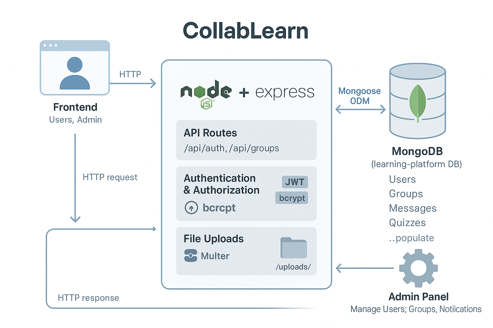

# Backend and MongoDB Explanation for CollabLearn

Based on the `CollabLearn/server/index.js` file, here's an explanation of the backend and MongoDB usage in the project:

**1. What is the Backend?**

*   **Role:** The backend is the server-side component of the `CollabLearn` application. It runs on a server (in this case, likely your local machine during development) and is responsible for handling the application's core logic, managing data persistence, responding to requests from the frontend (the user interface running in the browser), and facilitating real-time communication.
*   **Technology Stack:**
    *   **Node.js:** A JavaScript runtime environment that allows you to run JavaScript code on the server.
    *   **Express.js:** A popular web framework for Node.js that simplifies building web servers, defining API routes, and handling HTTP requests and responses.
    *   **Socket.IO:** A library enabling real-time, bidirectional communication between the web clients (browsers) and the server. This is used for features like live chat and instant notifications.
    *   **MongoDB:** The database used to store application data.
    *   **Mongoose:** An Object Data Modeling (ODM) library for MongoDB and Node.js. It provides a schema-based solution to model application data and handles the connection and interactions with the MongoDB database.
    *   **Other Libraries:** `cors` (for handling Cross-Origin Resource Sharing), `jsonwebtoken` (for creating and verifying authentication tokens), `bcryptjs` (for hashing passwords), `multer` (for handling file uploads).
*   **Key Functionalities:**
    *   **API Endpoints:** Defines various routes (e.g., `/api/auth/register`, `/api/auth/login`, `/api/quizzes`, `/api/groups`, `/api/messages`, `/api/upload`, `/api/admin/...`) that the frontend interacts with to perform actions.
    *   **Authentication & Authorization:** Handles user registration, login (checking email/password, hashing passwords with bcrypt), and session management using JSON Web Tokens (JWT). It includes middleware (`authenticateToken`) to protect routes that require a logged-in user and checks user roles (e.g., 'admin') for certain actions.
    *   **Data Management:** Uses Mongoose models (defined in `./models/`) to interact with the MongoDB database for Creating, Reading, Updating, and Deleting (CRUD) data related to Users, Groups, Messages, Content, Quizzes, Quiz Results, and Notifications.
    *   **Real-time Features:** Leverages Socket.IO for instant messaging within groups, user typing indicators, broadcasting notifications, and managing user connections/disconnections.
    *   **File Handling:** Manages file uploads using `multer`, storing files locally in the `./uploads/` directory and serving them via a static route (`/uploads`).
    *   **Admin Capabilities:** Provides specific API endpoints for administrators to manage users (list, disable, delete), view system statistics, manage groups (list all, delete), and send system-wide notifications.

**2. How is MongoDB Used?**

*   **Database Type:** MongoDB is a NoSQL, document-oriented database. Instead of storing data in tables with rows and columns like SQL databases, it stores data in flexible, JSON-like documents grouped into collections.
*   **Connection:** The application connects to a MongoDB instance running locally (`mongodb://localhost:27017`) and specifically uses a database named `learning-platform`. The connection is established using Mongoose.
*   **Mongoose ODM:** Mongoose is crucial for interacting with MongoDB.
    *   **Models & Schemas:** Files in `CollabLearn/server/models/` (e.g., `User.js`, `Group.js`, `Quiz.js`) define Mongoose Schemas. A schema specifies the structure, data types, validation rules, and default values for documents within a specific MongoDB collection (e.g., the `User` schema defines fields like `username`, `email`, `password`, `role`, `isDisabled`). Mongoose Models (`User`, `Group`, `Quiz`, etc.) are compiled from these schemas and provide the primary interface for querying the corresponding collections (`users`, `groups`, `quizzes`, etc.) in the database.
    *   **Database Operations:** The backend code uses Mongoose model methods to perform database operations:
        *   `Model.findOne({...})`: To find a single document matching criteria (e.g., finding a user by email).
        *   `new Model({...}).save()`: To create and save a new document (e.g., saving a new user, quiz, or message).
        *   `Model.find({...})`: To find multiple documents matching criteria (e.g., finding all groups a user is a member of).
        *   `Model.findById(...)`: To find a document by its unique `_id`.
        *   `Model.findByIdAndUpdate(...)` / `Model.updateOne(...)` / `Model.updateMany(...)`: To modify existing documents.
        *   `Model.findByIdAndDelete(...)` / `Model.deleteMany(...)`: To remove documents.
        *   `Model.aggregate([...])`: To perform complex data processing pipelines (e.g., calculating leaderboard scores).
        *   `.populate('field', 'selectFields')`: To automatically replace referenced document IDs in one collection with the actual document data from another collection (e.g., replacing the `sender` ID in a message with the sender's `username`).

In summary, the Express backend serves as the brain and communication hub, while MongoDB, managed through Mongoose, acts as the persistent memory, storing all the necessary data for the CollabLearn platform.
